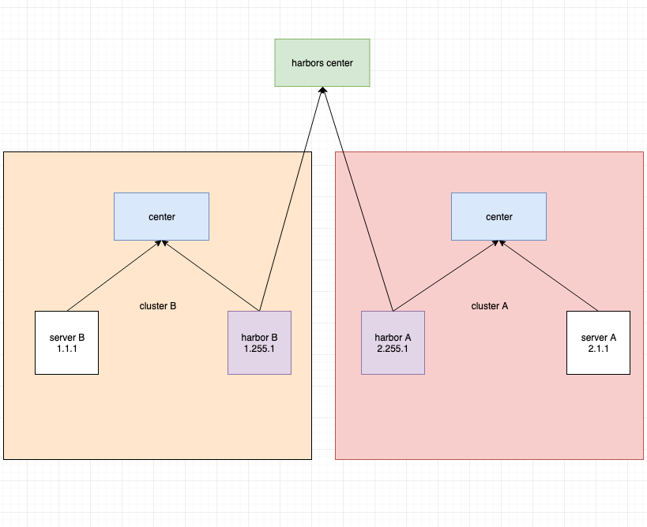

# 游戏服务端框架 

sanguo是一个简单的网络游戏服务端框架。可以快速构建服务器集群内部以及服务器与客户端时间的通信。集群内部采用TCP通信。服务器客户端之间
支持TCP,websocket通信方式。

服务器集群间支持两种通信模式：PRC及普通的消息传递。服务器节点使用一个逻辑地址作为标识，只要知道对端逻辑地址就可以与对端通信。集群内部通信节点会建立TCP连接，连接在首次通信请求时建立。

## 逻辑地址

各节点使用一个32位逻辑地址标识，逻辑地址被分为3段，高12位表示服务器组，中8位表示节点类型(255保留给harbor使用),低12位表示进程id。

## 协议添加

protocol是协议目录，其中有两个子目录ss和cs,分别表示集群内部协议和客户端服务器的交互协议。两个子目录下分别有一个名为proto_def的子目录，这个子目录存放了协议列表文件。例如protocol/proto_def/message.go

这个文件定义了集群内部的普通消息定义：

```go
package proto_def

var SS_message = []string {
	"heartbeat",
	"echo",
}
```

第一步） 在根目录下执行

​	make gen_ss

执行完成之后将会生成protocol/ss/proto/message/echo.proto和protocol/ss/proto/message/echo.proto两个协议文件


第二步） 按需求修改.proto文件之后再次执行

​	make gen_ss

这将产生protocol/ss/message/echo.pb.go和protocol/ss/message/heartbeat.pb.go两个文件以及register.go文件。

其中register.go文件用于将使用到的协议执行pb注册:

```go

package ss
import (
	"github.com/sniperHW/sanguo/codec/pb"
	"github.com/sniperHW/sanguo/protocol/ss/message"
	"github.com/sniperHW/sanguo/protocol/ss/rpc"
)

func init() {
	//普通消息
	pb.Register("ss",&message.Heartbeat{},1)
	pb.Register("ss",&message.Echo{},2)

	//rpc请求
	pb.Register("rpc_req",&rpc.EchoReq{},1)

	//rpc响应
	pb.Register("rpc_resp",&rpc.EchoResp{},1)

}
```


## rpc

sanguo通过pb协议定义远程方法例如在protocol/ss/proto_def/rpc.go中定义了echo方法，这将会生成对应的EchoReq以及EchoResp协议。
其中EchoReq用于请求,EchoResp用于返回响应。

rpc定义及产生骨架

第一步)

	在protocol/ss/proto_def/rpc.go文件中添加方法名

第二步) 生成.proto文件

	make gen_ss

第三步) 按需填写.proto文件

第四步) 生成.proto对应的.pb文件

	make gen_ss

第五步) 生成方法骨架

	make gen_rpc

以echo方法为例，执行完以上步骤之后将会生成rpc/echo/echo.go文件

下面的示例展示了如何实现echo方法以及注册


```go
	import(
		"github.com/sniperHW/sanguo/cluster"
		ss_rpc "github.com/sniperHW/sanguo/protocol/ss/rpc"
		echo "github.com/sniperHW/sanguo/rpc/echo"
	)

	//实现echo.Echo接口
	type Echo struct {

	}

	//方法实现
	func (this *Echo) OnCall(replyer *echo.EchoReplyer,arg *ss_rpc.EchoReq) {
		echoResp := &ss_rpc.EchoResp{}
		echoResp.Message = proto.String(arg.GetMessage())
		replyer.Reply(echoResp)	
	}

	//注册方法，完成之后远程请求到达时将调用Echo.OnCall
	echo.Register(&Echo{})	

```

客户端可以以同步/异步的方式调用远程服务

```go
	
	//同步调用
	echoReq := &ss_rpc.EchoReq{}
	echoReq.Message = proto.String("hello")

	resp,err := echo.SyncCall(peer,echoReq,0)
	if nil != err {
		fmt.Printf("%s\n",err.Error())
	} else{
		//对resp做处理
	}

	//异步调用

	echo.AsynCall(peer,echoReq,0,func(result *ss_rpc.EchoResp,err error){
		if nil == err {
			kendynet.Infof("echo response %s\n",resp.GetMessage())
		}
	})

```


完整示例可以参看example/ss/node1.go,example/ss/node2.go

## 运行示例程序

example/ss目录中的示例程序是为了展示集群内部的通信，所以在运行示例之前首先要启动center服务。

## 跨集群通信

如果通信目标与自己不在同一集群内，则无法与目标建立直接通信连接，为了跨集群通信，需要启动harbor节点，消息路由如下:

本机 -> 本集群内harbor节点 -> 目标所在集群harbor节点 -> 目标节点

多集群部署示意图:



如上图所示，有A,B两个集群，集群各自的harbor节点分别连接本集群的center以及harbors center。
当节点B向节点A发消息时，发现A不在本集群内无法建立直接通信，因此将消息发往harbor B,harbor B接收到路由请求后，根据目标地址
2.1.1将请求转发给harbor A(harbor A和harbor B连接了同一个harbors center,因此他们之间可以建立直接通信连接)。harbor A
接收到之后发现目标A可以直达，于是将消息发送给A。


